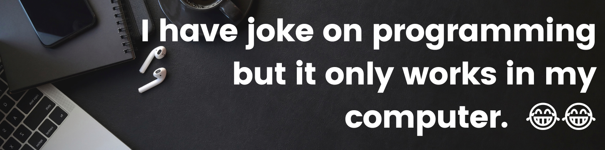
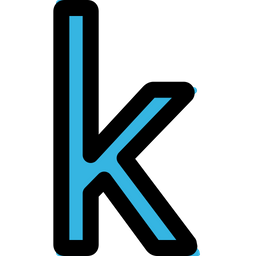

<h1 align="center">
  
</h1>

<h5 align="center">
  <code><a href="" title="LinkedIn Profile"> LinkedIn</a></code>
  <code><a href="" title="Kaggle Profile"> Kaggle</a></code>
  <code><a href="" title="Twitter Profile"> Twitter</a></code>
  <code><a href="" title="StackOverflow Profile"> StackOverflow</a></code>
</h5>
 

### Talking about Personal Stuffs:

- 🛠 &nbsp; I’m currently working with Tensorflow, PyTorch, Keras,   Flask, Django, Javascript, etc.
- 🚀 &nbsp; I’m currently learning Machine Learning and Deep Learning.
- 👨🏻‍💻 &nbsp; Most of my projects are available on [Github](https://github.com/GAUTAMSINGH102).
- 💬 &nbsp; Ask me about anything [here](https://github.com/GAUTAMSINGH102/GAUTAMSINGH102/issues/2)! I am happy to help.
- 📝 &nbsp; Checkout my [Resume]().
- 🤣 &nbsp; Fun fact: I will let you know when I know it myself. Ha Ha Hi Hi Ho Ho 🤣🤣

### My Absolute Favorites:

- 💻 &nbsp; I love exploring new tech stack and building cool stuffs.
- 🍕 &nbsp; Hackathons, meetups & tech events.

 
<h2 align="center">🔥 Languages & Frameworks & Tools & Abilities 🔥</h2>
 

  <code></code>
  <code></code>
  <code></code>
  <code></code>
  <code></code>
  <code></code>
  <code></code>

 

<h2 align="center">⚡ Github Statistics 👀</h2>
 

  

    
    
  

           
  

    
  

   

